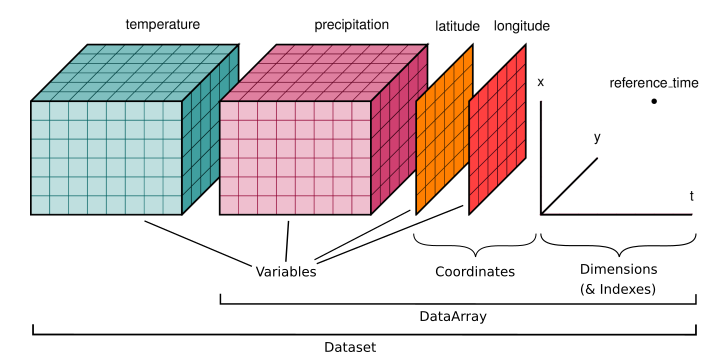

# Training GRIB and NetCDF

Basic manipulation of GRIB and NetCDF files under linux.

In this course we will learn :

- How to have Linux-ready environment with NetCDF and GRIB tools
- How to explore NetCDF and GRIB file from the command line
- How to explore NetCDF and GRIB file interactively


## Getting started

### Installing Conda package manager

Conda is an open source package management system and enviornment system. It allows to easily creates, saves, loads and switches between enviornments. Source :  https://docs.conda.io/en/latest/

* Open a terminal
* Download and install it

```
wget "https://github.com/conda-forge/miniforge/releases/latest/download/Mambaforge-$(uname)-$(uname -m).sh"
bash Mambaforge-$(uname)-$(uname -m).sh -b
${HOME}/mambaforge/condabin/conda init
source ${HOME}/.bashrc
```

### Install our tools

We will install the following tools :

* NetCDF4 library, cf. https://www.unidata.ucar.edu/software/netcdf/
* WGrib tools, cf. https://www.cpc.ncep.noaa.gov/products/wesley/wgrib.html
* CDO, cf. https://code.mpimet.mpg.de/projects/cdo/wiki/Tutorial
* GDAL, cf. https://gdal.org/


To proceed, type the following in a terminal : 

```
mamba install -y netcdf4
mamba install -y wgrib wgrib2
mamba install -y cdo
```


### Get sample data

We will download some test data to play with our tools :

* `air_temperature.nc` : NCEP reanalysis subset
* `gfs.t00z.pgrb2.1p00.f024` : GFS 1.0 forecast range +24h


To proceed, type the following in a terminal :

```
mkdir -p ${HOME}/data
cd ${HOME}/data
wget https://github.com/pydata/xarray-data/raw/master/air_temperature.nc
wget https://nomads.ncep.noaa.gov/pub/data/nccf/com/gfs/prod/gfs.20221026/00/atmos/gfs.t00z.pgrb2.1p00.f024
```

Now we are ready to explore our data.


## Explore NetCDF data


As introduction NetCDF data structure can be summarized as below :



Source : https://docs.xarray.dev/en/stable/user-guide/data-structures.html#dataset


### ncdump : check variable list

The first step to explore a NetCDF file is to use `ncdump` command. Type the following in a terminal :

```
ncdump -h air_temperature.nc
```

Questions :

- How many variables are presents in the file ?
- What is the meaning of each variable ?
- How many dimensions have the `air` variable ?


Bonus :

- Try the `ncinfo` command as well


### ncdump : check data values

We can explore data values with the following option :

```
ncdump -v lat air_temperature.nc
```

Questions :

- What is the bounding box of data in the file ? (eg. minimum and maximum latitudes and longitudes)
- How to display all values for the `air` variable ?


## Explore GRIB data

### wgrib : check variable list

The first step to explore a GRIB file is to use `wgrib` command. Type the following in a terminal :

```
wgrib2 era5-2mt-2019-03-uk.grib 
```

To get more details about one particular GRIB, you can use :

```
wgrib2 -d 0 -V gfs.t00z.pgrb2.1p00.f024
```


Questions :

- How many single GRIB are present in the file ?
- Can you describe some of the variable available ?


Bonus :

- Try the `grib_ls` command
- Try the `grib_dump` command


### wgrib : check data values


We can explore data values with the following option :


```
grib_dump -w shortName=prmsl gfs.t00z.pgrb2.1p00.f024 
```

Questions :

- What is the GRIB key indicating the date of the run ?
- What are the latitude and longitude of the GRIB ?


## Bonus : plotting with Python

You can easily plot graphical output using Xaray library, cf. https://docs.xarray.dev/en/stable/

* Open a linux terminal and add required packages

```
mamba install -y ipython xarray cfgrib matplotlib
```

* Open a python shell by typing :

```
ipython
```

* Type the following to create PNG output :

```
import xarray as xr
ds = xr.open_dataset("air_temperature.nc")
print(ds)
ds.plot()
```
